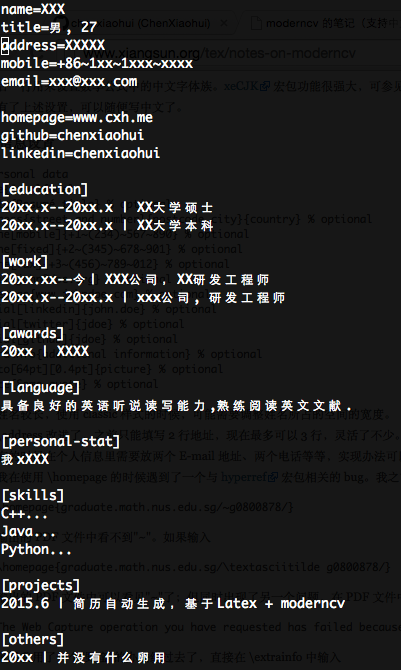
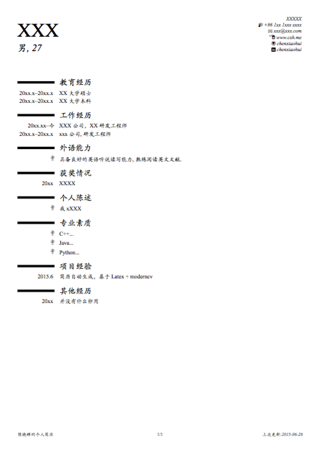
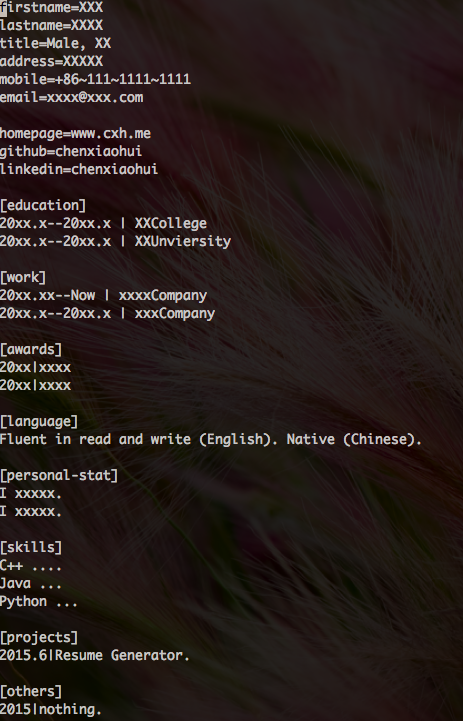
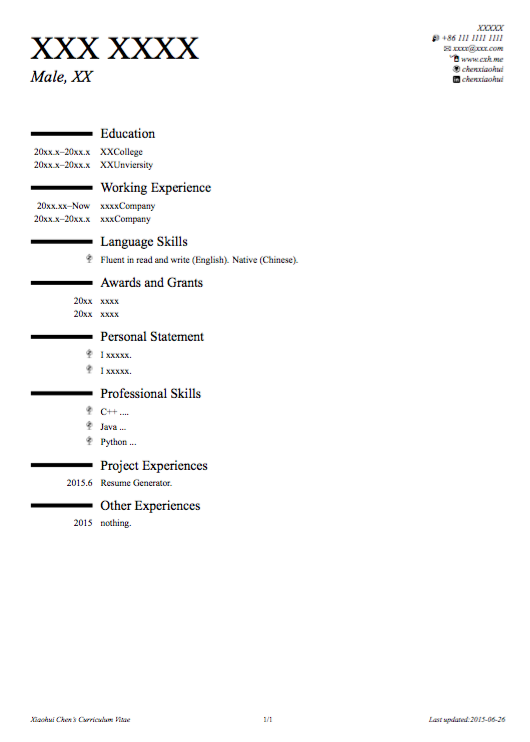

# 说明

通过文本文件生成简历tex的generator。最终生成pdf还是要靠Latex+Moderncv，环境请自行配置。 

- windows下：<http://www.ctex.org/HomePage>
- Linux下：<https://www.tug.org/texlive/>
- Mac下：<https://tug.org/mactex/>

需要的包都通过sudo tlmgr install package来安装。字体主要使用了Times New Roman（西文）和 Kaiti SC（中文）。可根据喜好换。

# 模板配置

config.tex 定义了公共头文件，包括包含的宏包，版面的布置和字体语言。

xxtemplate.tex定义了模板。模板语法比较简单，不给出严谨的语法定义了，主要如下两点：

1. %xxx% 表示一个变量，将来会从cv文件中查找对应名字的变量，找到之后替换这个%xxx%
2. %for=>xx% %endfor%表示一个循环，xx是section的name，将来会从cv文件中找到对应的section，然后parse section下的每个单独的项目，用结果替换for循环中的内容

	1. for循环中{0}{1}..表示一个for循环变量，cv中section下的条目会被分割成多个变量，顺序依次是0，1，2..，渲染的时候会对应的替换上述{0}{1}变量。如果数量不匹配会报错。

3. 如上语法部分关键字可以配置，在config.py中。可以酌情修改。

xx.cv包含了简历内容，格式上参考了ini文件格式，但是略有不同。

1. [section name]顶一个了一个section，对应简历中一个部分。section name的显示名称是在template里面写好的。这里的name只是给程序使用的，可以跟显示名称一致也可以不同。
2. 不包含在某个section下的条目通过 key = value的方式定义。不能跨行，程序parse的时候只找第一个等号，后面有空格等符号都不影响。
3. section下的条目每条可以包含多个字段，字段之间默认用竖线（|）分割（可修改）。字段的数量需要跟模板中对应section下for循环体中变量的数量一致。

程序中给出了几个实例，分别是英文、中文简历的template和cv文件，供参考。

# 使用

写好对应的cv和模板之后，make就行。open命令可能在mac之外的系统不能使用，建议注掉。

make distclean清空所有文件包括pdf
make again 是为了生成页码，xelatex跑第一遍的时候页码是乱码。
gen.py 文件格式如下：

	./gen.py <template-file> <cvfile> <output-file>

# 效果

# 参考文献:

>\[1] http moderncv 的笔记（支持中文）, <http://www.xiangsun.org/tex/notes-on-moderncv>
